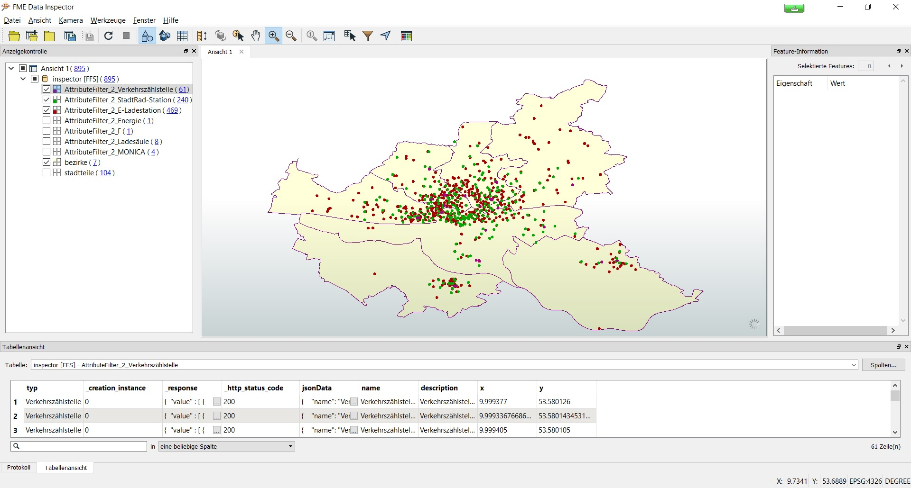
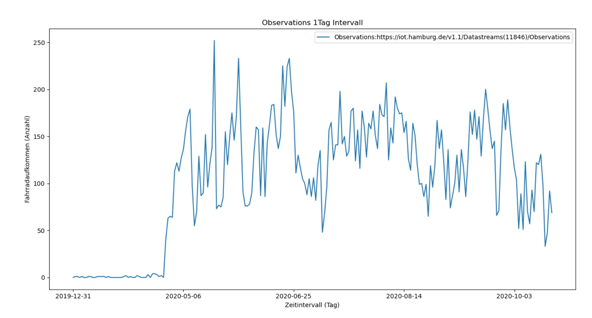
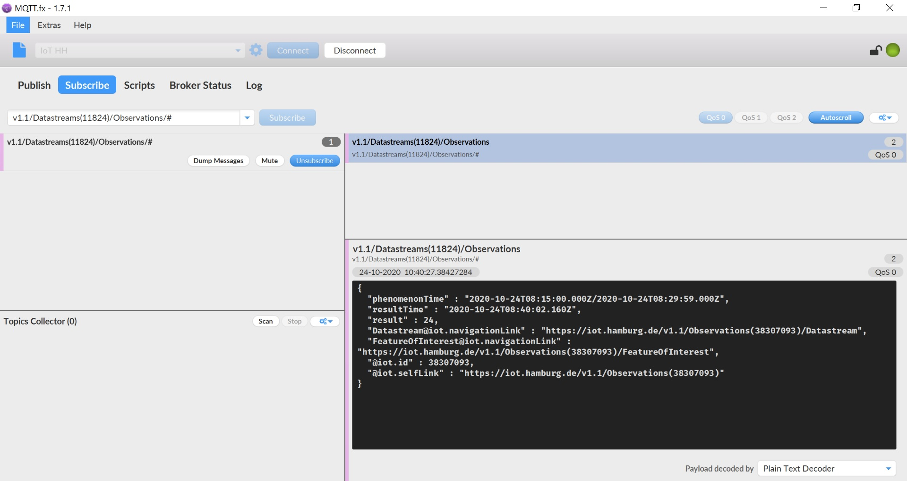

#

OGC SensorThings API (STA) in der Praxis
========================================

## Inhalt
* [Einleitung](#einleitung)
* [Sensordaten Überblick](#sensordaten-überblick)
* [Sensordaten Zugriff](#sensordaten-zugriff)
* [Summary](#summary)

## Einleitung
In unserem Hause wird seit einigen Jahren daran gearbeitet, eine skalierbare und sichere IoT-Infrastruktur aufzubauen. Ziel ist es, diverse Sensordaten von Behörden der Stadt einzusammeln und über die [SensorThings API](https://github.com/opengeospatial/sensorthings) der Öffentlichkeit zugänglich zu machen. Dazu wird der Fraunhofer Open Source SensorThings API Server - [FROST](https://www.iosb.fraunhofer.de/servlet/is/80113/) eingesetzt.

Wir wollen diese [SensorThings API](https://iot.hamburg.de/v1.1) in Version 1.1 hier einmal antesten. Wir werden uns ansehen, was für Daten angeboten werden und wie gut sie zugänglich sind, d.h. wie gut ein Nutzer damit arbeiten kann.

## Sensordaten Überblick
Zunächst verschaffen wir uns einen Überblick. Mit diesem [Python Client](src/staClient_1_overview.py) lassen wir uns die Anzahl der Objekte je [STA Klasse](https://fraunhoferiosb.github.io/FROST-Server/sensorthingsapi/STA-Data-Model.html) ausgeben. Das sind 784 Things mit 1.562 Datastreams, 4 Arten von Sensoren und ca. 22 Mio. Messwerten (*Observations*), was noch recht  überschaubar ist.

Im nächsten Schritt sehen wir uns mit Hilfe der [FME Workbench](fme/staThings.zip) an, welche Arten von Things es gibt und wie sie räumlich verteilt sind (*vgl. Abb. 1*). Wir haben es mit 469 E-Ladestationen, 240 Stadt-Rad-Stationen sowie 61 Verkehrszählstellen zu tun. Diese erzeugen jeweils 1 bis n Datastreams.

* 469 E-Ladestationen mit je 1 bis n Datastreams (Status eines Ladepunktes, near real-time)
* 240 Stadt-Rad-Stationen mit je 1 Datastream (verfügbare Stadträder, 5min Intervall)
* 61 Verkehrszählstellen mit je 4 Datastreams (erfasste Fahrräder, 15min, 1h, 1d, 1w Intervall)

Zum Schluss werfen wir noch einen Blick auf die Zeitreihen (*Observations*).

* E-Ladestationen: wir finden in der Zeitreihe für jede Statusänderung einen Wert; größere Lücken enthalten
* Stadt-Rad-Stationen: wir finden in der Zeitreihe für jede Änderung der Radanzahl einen Wert; Speicherung erfolgt 5min zeitversetzt
* Verkehrszählstellen: wir finden aggregierte Werte in den Intervallen 15min, 1h, 1d, 1w; für den kürzesten (15min) Intervall erfolgt die Speicherung 10min zeitversetzt

Abb. 1: Things Arten und ihre räumliche Verteilung

## Sensordaten Zugriff
Die Sensordaten können wir über **HTTP GET** oder [**MQTT**](https://mqtt.org/) beziehen. Dabei erhalten wir über beide Protokolle Zugriff auf die gleichen Sensordaten. Daraus lässt sich schlussfolgern, dass auf dem FROST-Backend ein MQTT-Adapter sitzt, der die Daten an den MQTT-Broker (*mqtt://iot.hamburg.de:1883*) sendet, bei dem wir diese abonnieren können. Der MQTT-Broker empfängt die Daten also nicht direkt von den Sensoren und erhält sie bei den Verkehrszählstellen und Stadt-Rad-Stationen auch nur in aggregierter Form.

Per HTTP können wir alle Messwerte eines Datastreams runterziehen, was sich insbesondere für Analysen auf den aggregierten Zeitreihen anbietet. MQTT bietet sich dagegen eher für die fast Echtzeitdaten an, bei denen uns immer nur der aktuellste Wert interessiert, den wir uns bsp. in einer App anzeigen lassen wollen. Beide Varianten werden wir uns an einem Beispiel ansehen.

Mit dem [Python Client](src/staClient_2_observations.py) holen wir uns für die Verkehrszählstelle [5576](https://iot.hamburg.de/v1.1/Things(5576)), per **HTTP GET Request**, alle [Messwerte](https://iot.hamburg.de/v1.1/Datastreams(11846)/Observations?$orderBy=phenomenonTime%20desc&$count=true&$top=100&$skip=0) (*Observations*) im 1 Tagesintervall und plotten sie in einem Liniendiagramm (*vgl. Abb. 2*). Dabei nutzen wir das Paging, d.h. wir laden pro Request max. 100 Observations herunter.

Abb. 2: Line Chart Observations

Als nächstes werden wir für die Verkehrszählstelle Daten im 15min Intervall vom MQTT-Broker (*mqtt://iot.hamburg.de:1883*) beziehen. Das lässt sich mit dem Python package [*paho-mqtt*](https://pypi.org/project/paho-mqtt/) bewerkstelligen. Allerdings wird uns das aus dem Unternehmensnetz nicht über den HTTP-Proxy gelingen, da MQTT und HTTP zwei verschiedene Protokolle sind. Deshalb habe ich dies außerhalb des Unternehmensnetzes getestet und hierfür den [MQTT.FX Client](https://mqttfx.jensd.de/index.php) verwendet (*vgl. Abb. 3*). Dazu musste ich zuvor in der Firewall den Port 1883 öffnen. Der MQTT-Broker bietet nur unverschlüsselten Traffic über den Port 1883 im *Quality of Service (QoS)* Level 0 (*Fire-and-forget*) an. Es wird kein MQTT über Websockets unterstützt.

Abb. 3: MQTT.fx mit Observations Message

## Summary
In diesem Beitrag haben wir uns etwas mit der OGC SensorThings API und MQTT vertraut gemacht. Nachdem wir das Datenmodell der SensorThings API verinnerlicht haben, können wir mit der HTTP Schnittstelle sehr gut arbeiten. Man benötigt zusätzlich noch eine räumliche Visualisierung der Things, sei es über FME (*vgl. Abb. 1*) oder eine WebMapping Applikation. Das System ist sehr performant. Allerdings enthält es bisher auch nur wenige Daten. Die Zeitreihen sind sehr kurz. Ich würde es daher noch in das Stadium Prototyp einordnen.

Mit MQTT ist es etwas schwieriger, wie wir gesehen haben. Hier gibt es noch Optimierungspotential. Insbesondere würde MQTT über Websockets es dem Endanwender sehr viel einfacher machen. Dies wird vom FROST-Server auch unterstützt. Damit lassen sich die MQTT Nachrichten dann direkt im Web Browser empfangen, z.B. mit dem [MQTT Browser Client](http://www.hivemq.com/demos/websocket-client/) von HiveMQ. Außerdem können wir erwarten, dass die Kommunikationskanäle (*MQTT connection settings*) in den [Metadaten](https://metaver.de/trefferanzeige?docuuid=785D987C-AAFF-471D-AE3A-EBCD4C9E23F1&plugid=/ingrid-group:ige-iplug-hmdk.metaver&docid=785D987C-AAFF-471D-AE3A-EBCD4C9E23F1) vollständig beschrieben werden, trotz ihrer Listung in der [STA](https://iot.hamburg.de/v1.1) (ganz am Ende).
